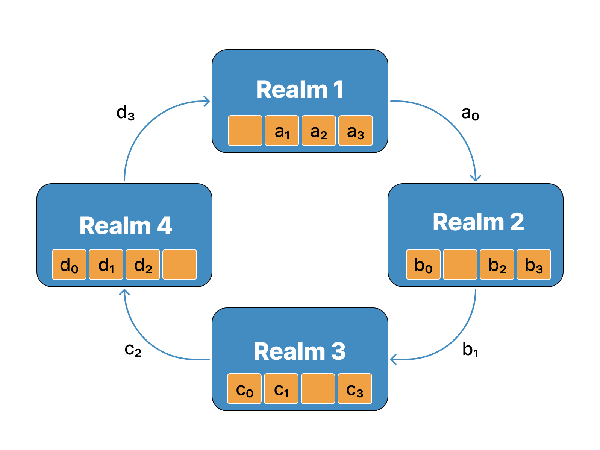
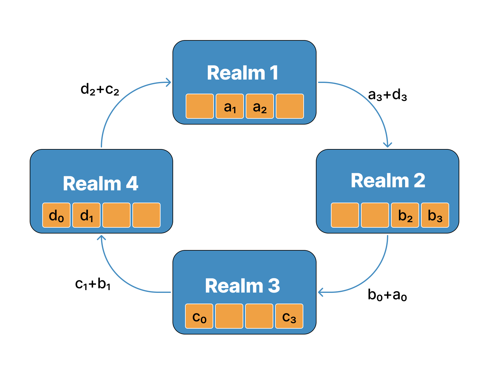
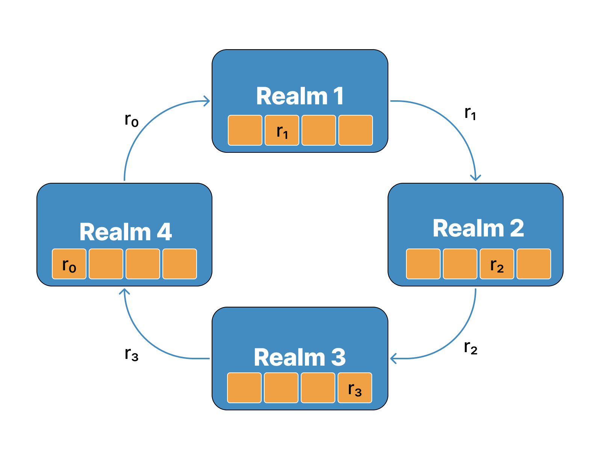
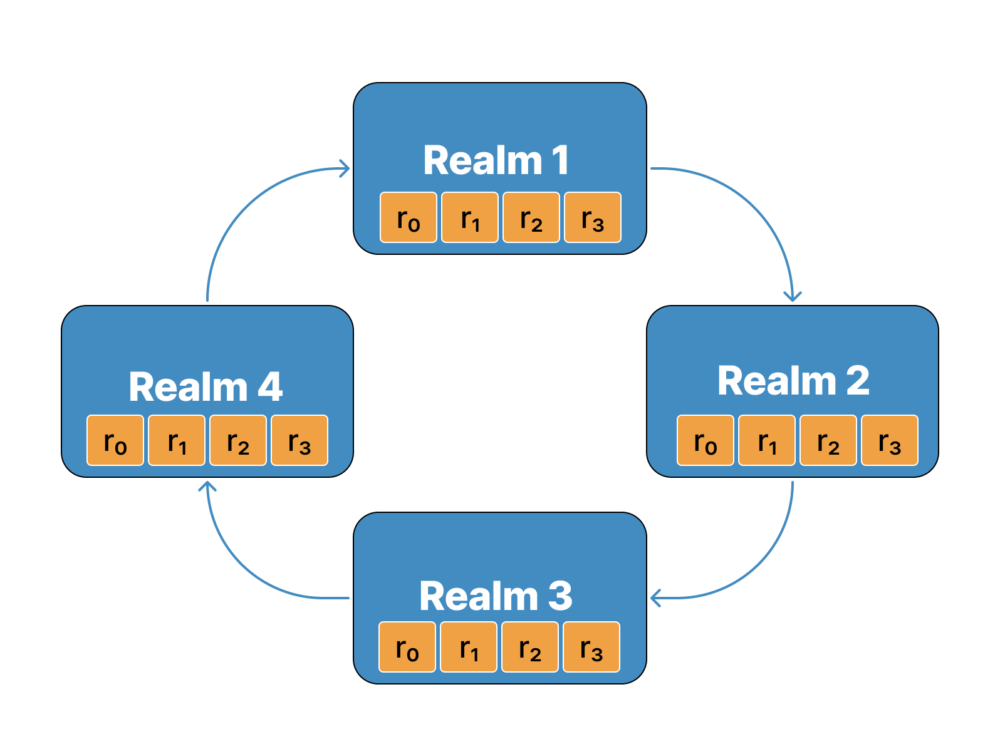

# The Great Search

## Scenario
A great treasure known as the **Eye of Odin** has been lost for centuries, and it is believed to hold immense power. The gods and inhabitants of all Nine Realms seek to find the Eye, but they fear that if one realm finds it before the others, they may use its power to **betray** the rest. 

To prevent this, the gods of each realm agree to work together to find the Eye. They decide that each realm will search for evidence of the Eye's location simultaneously, and they will share their findings with each other in order to piece together the puzzle and locate the treasure.

The search for evidence begins, and the gods and inhabitants of all Nine Realms scour their lands for clues. They discover that the Eye of Odin is not a single object, but rather a set of powerful magical artifacts that have been scattered throughout the Nine Realms. Each artifact has been hidden by powerful magic, and only by combining the knowledge and resources of all Nine Realms can the artifacts be located and brought together.

## Problem
Given a list of json objects of all the realms (not necessarily 9) where each object represents a realm, it contains:
- The `rank` of the realm in the world (think of it as a unique ID).
- `data[]` a list (array) of all the evidences found by the realm.

The realms are placed in the world in a ring-like pattern. Conceptually this algorithm has every realm share its data (evidences) with the next realm in the ring and applies an operation to combine their knowledge. This operation can be any function, such as sum, multiplication, max or min.

There are two phases. The first phase, the `share-combine` phase, and then a `share-only` phase.

### Share-combine



### Share-only



# Your task
Your task is to return the state of the whole system at a given timestamp (not necessarily the final result) i.e you will return the rank of each realm and the corresponding data in the same json structure as the input.

# Example
Given
```
Realms_list = [{
    'rank': 3, 
    'data': [9, 81, 98, 33]
    },

    {'rank': 2,
    'data': [94, 29, 55, 56]
    },

    {'rank': 0,
    'data': [80, 38, 94, 22]
    },
    {'rank': 1,
    'data': [81, 71, 36, 45]
}]
```

at state 2 it will output:

```
realm 0: [None, 38, 247, None]

realm 1: [None, None, 36, 100]

realm 2: [255, None, None, 56]

realm 3: [9, 181, None, None]
```

# Constraints
- `data` length is equal to the realms number for simplicity.

- each `rank` is unique.