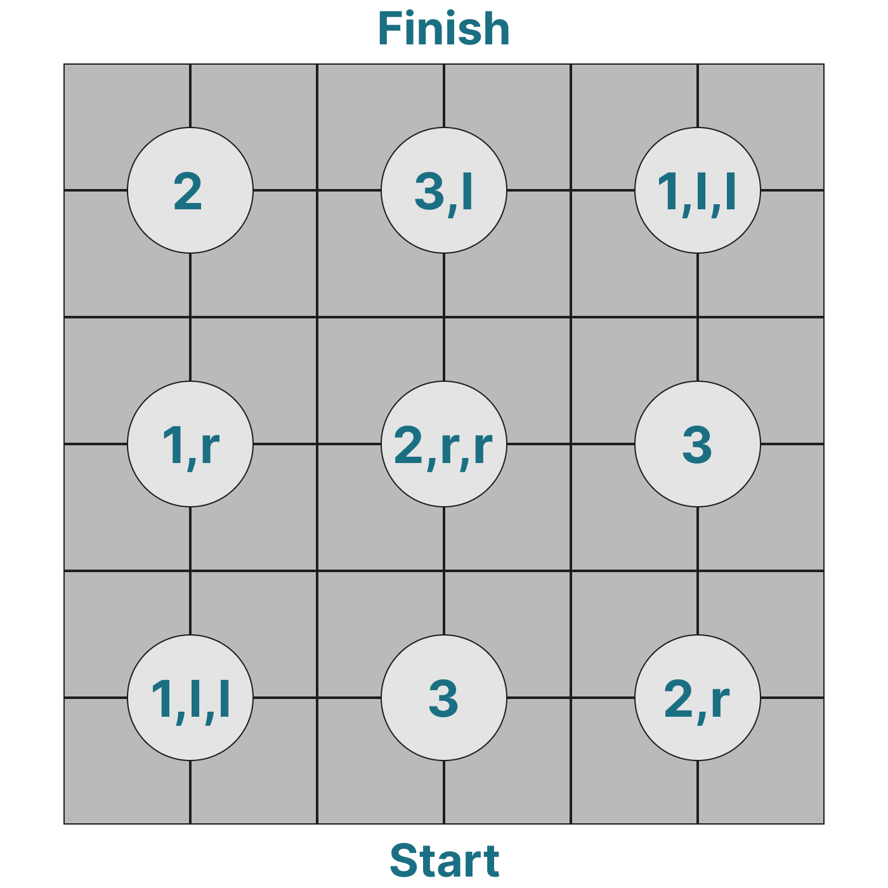

# Platform Maze

## Scenario
During the **Great search**, in the realm of **Midgard**, you are one step away from finding the **Sightstone**, one of the nine artifacts of the Eye of Odin. 

You have to find the shortest path through a platform maze, each tile in the maze could be a trap and make an end to your journey. luckily you found a letter, flipped it over for a set of diagrams, that will help you navigate the upcoming platform maze.

### Platform maze

### Hint letter


## Problem
Given `maze` an `n x m` matrix  representing the platform maze, and `hint` is the hint matrix `(n/2 x m/2)` containing the symbols in the middle of each grouping of four tiles.  

When you reach the platform maze, pay attention to the symbol. As importantly, you also need to consider which direction each symbol is facing, For example:
- `"l"` means that the group of four tiles is rotated by 90° to the left.

# Your task
Your task is to:
-  First find all the skull platforms as shown in the picture above by putting `"X"` in the corresponding cell in  the matrix `maze`.
- And then find the shortest path if there is a path.

## Example:
```py
 - maze = [["T", "T", "T", "T", "T", "T"],
            ["T", "T", "T", "T", "T", "T"],
            ["T", "T", "T", "T", "T", "T"],
            ["T", "T", "T", "T", "T", "T"],
            ["T", "T", "T", "T", "T", "T"],
            ["T", "T", "T", "T", "T", "T"]]

- hint = [["2", "3,l", "1,l,l"],
            ["1,r", "2,r,r", "3"],
            ["1,l,l", "3", "2,r"]]
 ```

The marked matrix would be:
```py
marked
['X', 'X', 'X', 'X', 'X', 'T']
['T', 'T', 'T', 'X', 'T', 'T']
['T', 'T', 'T', 'T', 'T', 'X']
['X', 'T', 'X', 'X', 'X', 'X']
['X', 'T', 'T', 'X', 'T', 'X']
['T', 'T', 'X', 'X', 'T', 'X']
```

The shortest path is marked by "P" as follows:
```py
['X', 'X', 'X', 'X', 'X', 'P']
['T', 'T', 'T', 'X', 'P', 'T']
['T', 'T', 'P', 'P', 'T', 'X']
['X', 'P', 'X', 'X', 'X', 'X']
['X', 'P', 'T', 'X', 'T', 'X']
['P', 'T', 'X', 'X', 'T', 'X']
```

## Data types:
 - `maze`, `hint`: matrix of char

## Constraints
- The number of `"l"` or `"r"` in a signle group of four tiles isn't limmited and they may appear together at any order.
- mark the skull platforms by capital "X"
- mark the path by capital "P"
- Consider diagonals when searching for the path.
- The start point is the first 
non-marked element in the last row of the matrix `maze` (left to right)
- The finish point is the first 
non-marked element in the first row of the matrix `maze` (left to right)
